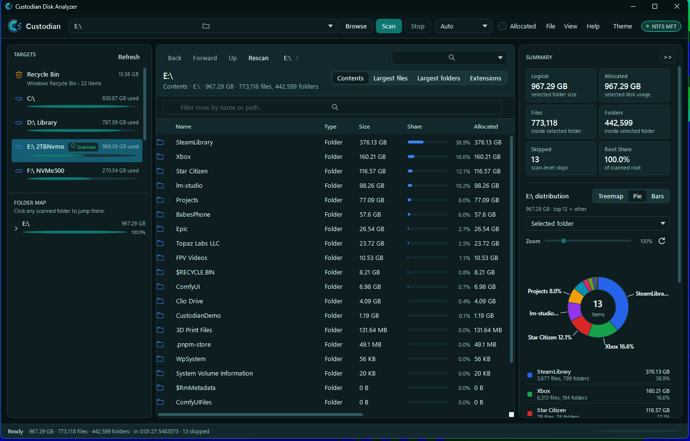
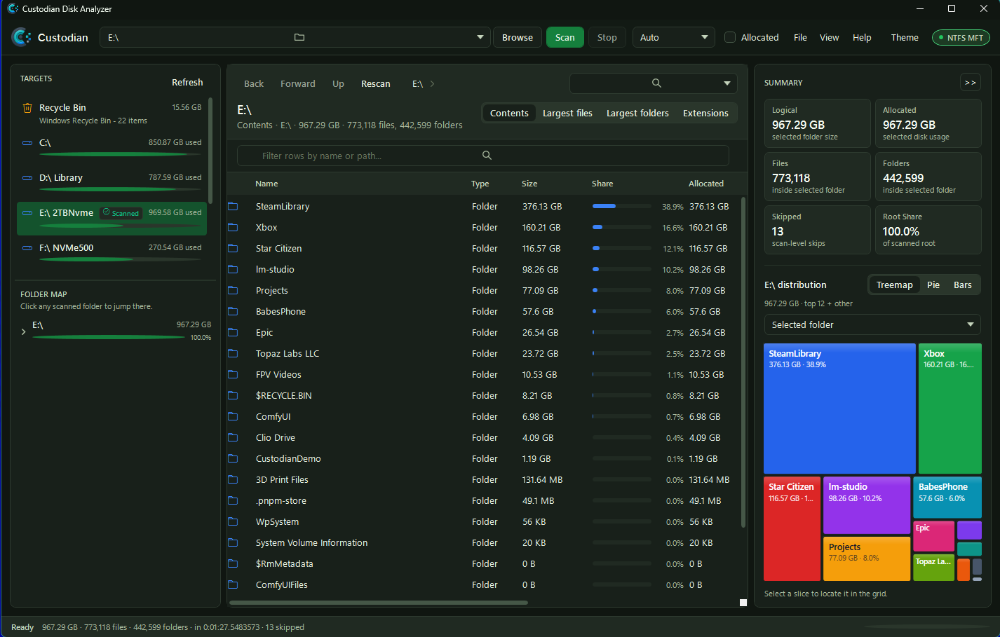
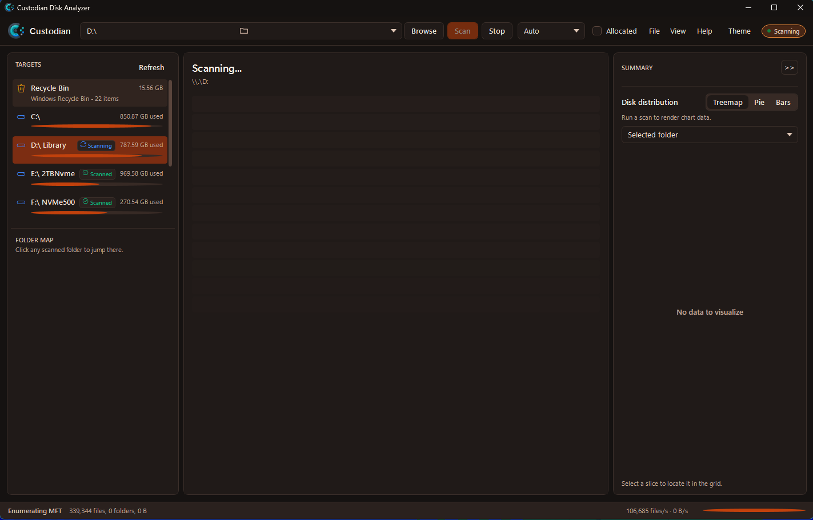
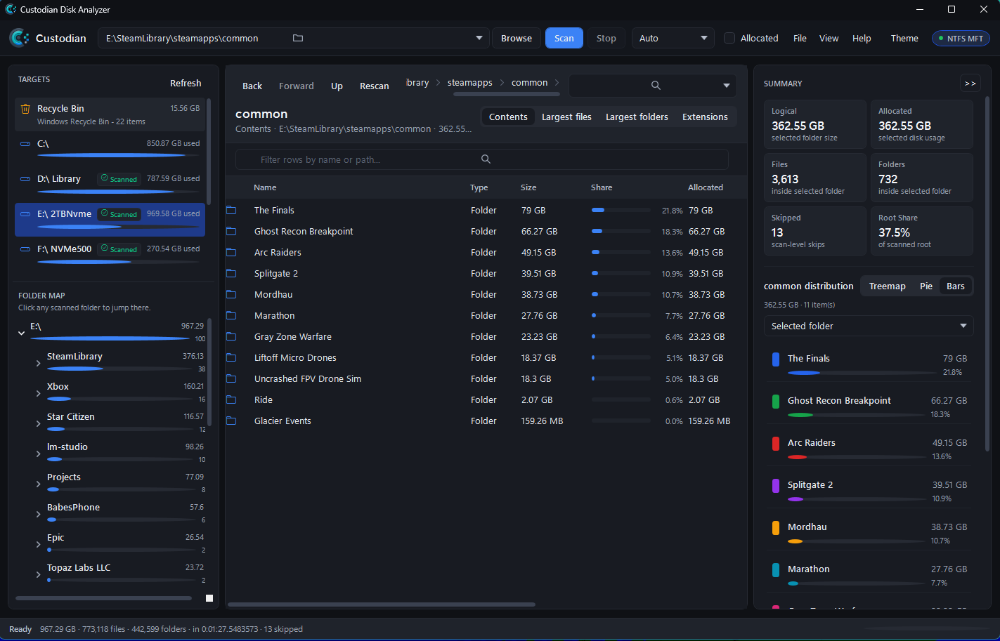

# Custodian Disk Analyzer

[](https://github.com/ctech1313/custodian/releases/latest)
[](#requirements)
[](https://dotnet.microsoft.com/)

Custodian is a Windows disk usage analyzer for machines where you need fast,
local inspection without depending on third-party desktop utilities. It ships as
a self-updating desktop app, a portable desktop app, a full-screen terminal UI,
and a CLI for repeatable server or workstation workflows.



## Why Custodian?

- **Find space quickly** with folder trees, sortable detail grids, largest-file
  and largest-folder views, extension summaries, treemaps, pie charts, and bar
  charts.
- **Switch between drives without losing context** with a session scan cache
  that restores recent scan results, selected folder, detail mode, and chart
  scope while Custodian stays open.
- **Choose the right scanner** with Auto mode, recursive scanning for folders
  and network shares, and optional NTFS MFT scanning for local NTFS volumes.
- **Scan cloud sync roots safely** through provider-aware OneDrive, Nextcloud,
  and Dropbox targets that use local desktop-client metadata only and avoid
  intentional placeholder hydration.
- **Inspect Android phone storage** when Windows exposes an unlocked phone
  through USB File Transfer / MTP, with read-only metadata scans of each
  readable storage root plus safe copy-to-PC actions.
- **Run in locked-down environments** with a portable build, a CLI, UNC path
  support, a full-screen TUI, safe fallbacks when raw NTFS access is
  unavailable, and an optional always-open-as-administrator launch setting.
- **Review before deleting** with Recycle Bin management, restore, permanent
  delete, empty-bin actions, and confirmation prompts.
- **Keep results portable** with `.custodian-scan` SQLite save files plus CSV
  and JSON export from the desktop app or CLI.
- **Handle untrusted scan data defensively** with CSV formula neutralization,
  remote-path confirmation before opening saved entries, hardened SQLite
  connection handling, and redacted update-source logging.
- **Stay updated** through Velopack-powered GitHub Releases for installed
  desktop builds.

## Screenshots

| Scan overview | Treemap distribution |
| --- | --- |
|  |  |

| Scan in progress | Folder drilldown |
| --- | --- |
|  |  |

The desktop app keeps targets, scan navigation, sortable detail rows, summary
metrics, and charts visible in one workspace so repeated cleanup passes do not
require jumping between windows.

## What's New In 1.5.6

- Update packages now enforce explicit publisher and file-identity rules for
  all executable content, independently fail closed when certificate
  revocation status is unavailable, and reject unsafe or oversized archives
  before extraction.
- Imported `.custodian-scan` files are review-only for file mutations: Copy,
  Move, Recycle, and Permanent Delete require a new live scan, while paths and
  rows can still be copied or exported.
- Release assets now include an SPDX SBOM, SHA-256 checksums, GitHub artifact
  attestations, and immutable-release protection.

No evidence of compromise was identified during the security review.

## Privacy And Safety

Custodian is built for local and locked-down environments. Scans run on the
machine where the app is launched; Custodian does not upload file metadata to a
cloud service. Cloud-provider support discovers local OneDrive, Nextcloud, and
Dropbox sync roots from desktop-client metadata and scans them as local folders;
it does not authenticate to those services, call cloud APIs, upload data, or
intentionally download online-only placeholders. Android / MTP support is
read-only for phone storage, and copy operations write only to the PC
destination you choose. Opening entries from a saved scan prompts before touching
network or remote paths, because saved scan files can come from untrusted
sources.

## Download

Get the latest release from:

https://github.com/ctech1313/custodian/releases/latest

Release assets include:

- `Custodian.DiskAnalyzer-win-Setup.exe` - installed desktop app with updates.
- `Custodian.DiskAnalyzer-win-Portable.zip` - portable desktop app, TUI, and CLI.
- `Custodian.DiskAnalyzer-<version>-full.nupkg`, `RELEASES`, and
  `releases.win.json` - Velopack update assets for installed clients.
- `Custodian-<version>.spdx.json` and `SHA256SUMS.txt` - release provenance and
  integrity metadata.

## Requirements

- Windows 10, Windows 11, or Windows Server with Desktop Experience for the WPF
  desktop app.
- Administrator launch is recommended for full local NTFS MFT access.
- Android phone scanning requires the desktop app, an unlocked phone, and USB
  File Transfer mode. Custodian can analyze phone metadata, open selected phone
  folders or files in Explorer when Windows supports it, and copy selected files
  to the PC, but it does not delete, rename, move, or modify files on the phone.
  Allocated-size/MFT data is not available.
- The TUI and CLI can run in more constrained server workflows, including
  terminal sessions, scheduled jobs, recursive scans, and export tasks.

## Desktop Workflow

1. Choose a drive, folder, OneDrive sync root, UNC path, or connected phone
   storage root.
2. Pick Auto, Recursive, or MFT scanning.
3. Scan and inspect space by folder, file, extension, or chart slice.
4. Switch to another drive and return to any cached scan without rescanning.
5. Save the scan for later, export CSV/JSON, or manage deleted items through the
   Recycle Bin view.

Custodian warns when it is not running as administrator and can relaunch itself
elevated when you need MFT scanning to reach protected NTFS metadata.
Use View > Always open as administrator when you want Windows to request
elevation before future launches instead of starting normally and relaunching.

Drive targets show whether a scan is currently running or already cached for
the session. Uncached drives show a Start Scan prompt instead of clearing the
workspace without direction.

OneDrive, Nextcloud, and Dropbox roots appear under Targets when local desktop
client metadata exposes a sync folder. OneDrive includes common
personal/business account roots and Known Folder Move folders under that root.
The desktop Targets pane includes a Cloud toggle for hiding or showing
cloud-provider rows and mounted cloud drives without changing manual path scans.
Cloud-provider targets use the recursive scanner even when Auto or MFT is
selected, and saved scans/exports carry provider metadata so the source remains
clear later.

Connected Android phones appear under Targets when Windows exposes readable MTP
storage. If a phone is locked or left in charging-only mode, Custodian shows a
target hint asking you to unlock the phone and choose File Transfer mode.
Phone scan rows can be opened in Explorer at the storage-root level or copied
to a PC folder; selected folders copy recursively and existing PC files are
left untouched by auto-renaming duplicates.

## CLI Examples

```powershell
custodian scan C:\Data --out data.custodian-scan
custodian scan \\server\share --export share.csv --silent
custodian export data.custodian-scan --format json --out data.json
```

## TUI Examples

```powershell
.\tui\Custodian.Tui.exe
.\tui\Custodian.Tui.exe --scan C:\Data --mode auto
.\tui\Custodian.Tui.exe --open data.custodian-scan
```

The TUI provides keyboard/mouse terminal navigation for scans, saved scan files,
terminal-native charts, Recycle Bin review, Android / MTP scan and copy actions,
CSV/JSON export, update checks, and elevation settings. It shares the same local
scan and safety behavior as the desktop app.

## Build From Source

```powershell
dotnet restore
dotnet build
dotnet test
.\scripts\publish-portable.ps1
```

The portable output is written to `artifacts\portable\Custodian`.

## Release Packaging

The primary installer and update channel are built with Velopack:

```powershell
.\scripts\publish-velopack.ps1 -Version 1.5.6
```

Release assets are written under `artifacts\velopack`. Publish those assets to
GitHub Releases so installed apps can discover updates:

```powershell
$env:GH_TOKEN = "<token with release access>"
.\scripts\upload-velopack-github.ps1 -Version 1.5.6 -ExpectedCommit <40-character-SHA>
```

The repo pins `vpk` 0.0.626 because newer tool builds require a .NET runtime
that may not be installed in the current development environment.

### Code signing

Custodian release scripts can sign Windows artifacts with Azure Artifact Signing
(formerly Azure Trusted Signing). Install Microsoft's client tools on the build
machine first:

```powershell
winget install -e --id Microsoft.Azure.ArtifactSigningClientTools
```

Then authenticate with Azure. For local signing, `az login` is enough when the
Azure CLI is installed and the signed-in identity has the certificate-profile
signer role. The protected GitHub release workflow uses federated OIDC and does
not store an Azure client secret.

Provide the signing profile with either a metadata file:

```powershell
$env:CUSTODIAN_AZURE_SIGNING_METADATA = "C:\secure\custodian-signing.json"
```

or environment variables:

```powershell
$env:CUSTODIAN_AZURE_SIGNING_ENDPOINT = "https://eus.codesigning.azure.net"
$env:CUSTODIAN_AZURE_SIGNING_ACCOUNT = "<artifact-signing-account>"
$env:CUSTODIAN_AZURE_SIGNING_PROFILE = "<certificate-profile>"
```

Build signed Velopack release assets with:

```powershell
.\scripts\publish-velopack.ps1 -Version 1.5.6 -Sign
```

The `-Sign` switch uses `scripts\sign-azure-artifact.ps1` through Velopack's
signing template so the packaged PE files and generated installer are signed and
verified. The portable package can be signed before zipping with:

```powershell
.\scripts\publish-portable.ps1 -Sign
```

If SignTool or `Azure.CodeSigning.Dlib.dll` are installed in a nonstandard
location, set `CUSTODIAN_SIGNTOOL_PATH` and
`CUSTODIAN_AZURE_SIGNING_DLIB_PATH`, or pass `-SignToolPath` and
`-AzureSigningDlibPath`.

## Changelog

See [CHANGELOG.md](CHANGELOG.md) for release notes.

## Update Configuration

Custodian follows the update channel embedded in the installed Velopack package.
The scripts default to the `win` channel; pass `-Channel <name>` when producing
or uploading another channel.

Installed apps check for updates on startup by default. Use Help > Automatically
download updates on startup to turn the launch-time check/download on or off;
Custodian still asks before restarting to install a downloaded update.

Optional environment overrides:

- `CUSTODIAN_UPDATE_CHANNEL` - deliberate local or managed channel override.
- `CUSTODIAN_GITHUB_TOKEN` - token for authenticated GitHub release checks in
  managed deployments.
- `CUSTODIAN_UPDATE_PRERELEASES` - set to `0` or `1` to override prerelease
  checks for non-stable channels.
- `CUSTODIAN_UPDATE_SOURCE` - local release folder for unsigned update testing.

For local update validation without GitHub Releases, run
`scripts\prepare-local-update-test.ps1`, install the preserved baseline setup,
set `CUSTODIAN_UPDATE_SOURCE` to the generated local release folder, and launch
the installed test build.

## Legacy Installer

The Inno Setup script at `installer\Custodian.iss` packages the portable publish
output and creates Start Menu shortcuts for the GUI, TUI, and CLI. This path
remains available for manual or legacy installs, but it is not the auto-update
channel.
After compiling the Inno installer, sign it with:

```powershell
.\scripts\sign-azure-artifact.ps1 -Path .\artifacts\installer\CustodianSetup.exe
```

## License

Custodian is released under the [MIT License](LICENSE).

Copyright (c) 2026 C-Tech Solutions LLC.
